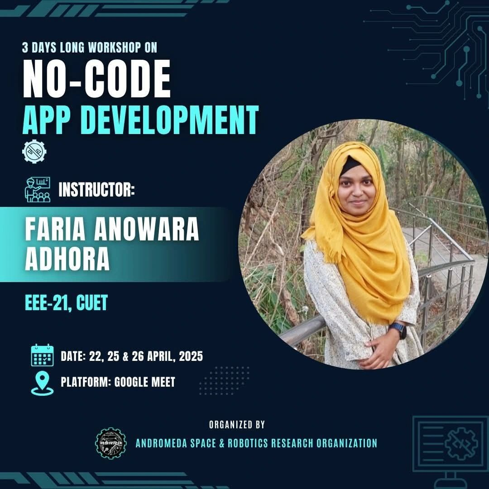
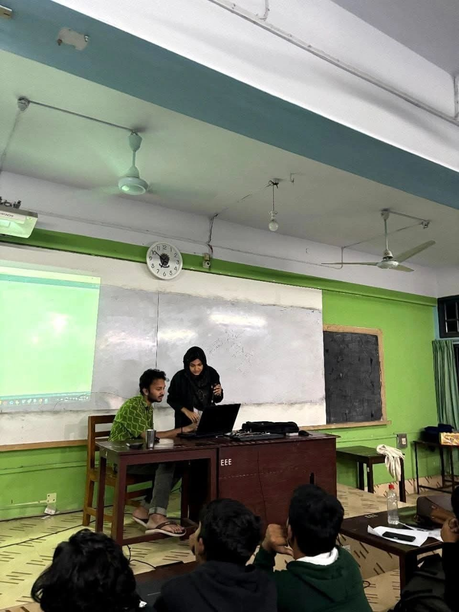
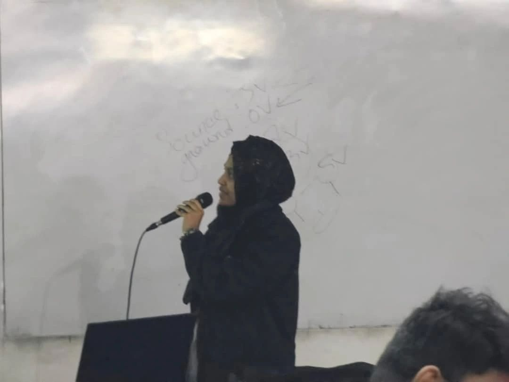
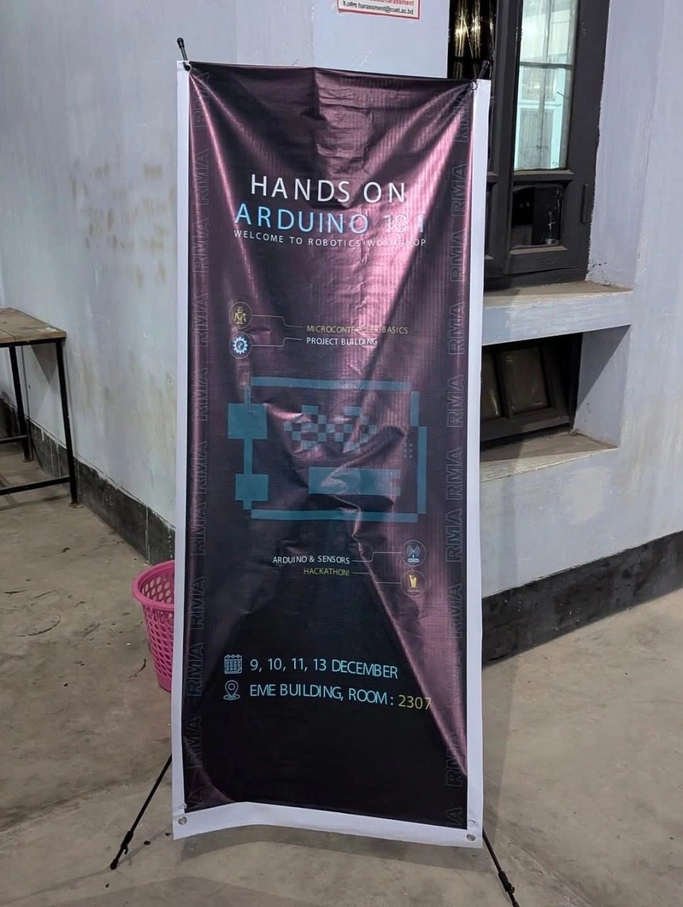

## Workshops & Trainings

### No-Code App Development Workshop — Instructor  
I conducted a 3-day online workshop on **No-Code App Development** organized by the **Andromeda Space & Robotics Research Organization (ASRRO)**.  
In this workshop, I taught the basics of no-code platforms, guided participants through building exciting apps, and demonstrated how to integrate these apps with microcontrollers.  
- **Dates**: April 22, 25 & 26, 2025  
- **Platform**: Google Meet  
- **Role**: Instructor  
- **Organized By**: Andromeda Space & Robotics Research Organization (ASRRO)  
- **Location**: Online

### Hands-on Arduino Workshop — Instructor  
I led a hands-on workshop teaching Arduino basics, programming, and practical applications to participants. This workshop was designed to provide experiential learning in microcontroller programming and embedded systems.  
- **Role**: Instructor  
- **Details & Highlights**: [LinkedIn Post](https://www.linkedin.com/posts/faria-anowara-adhora_thrilled-to-share-that-i-was-part-of-the-activity-7275554028938276865-YQRu)  
- **Platform**: [CUET]  

